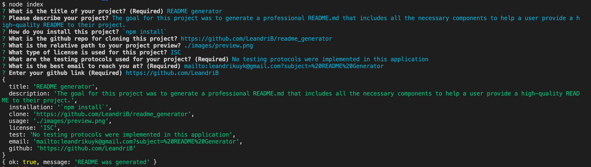

  
  # README generator

    The goal for this project was to generate a professional README.md that includes all the necessary components to help a user provide a high-quality README to their project.

  ## Contents

  - [Installation](#installation)
  - [Usage](#usage)
  - [Contributing](#contributing)
  - [Tests](#tests)
  - [License](#license)
  - [Questions](#questions)

  ## Installation

  Run the following command in your terminal in order to clone this repo:

  `npm install`

  ## Usage
  
  

  ## Contributing

  In order to contribute, create a pull request and follow the steps listed below:

    - Fork the repo
    - Create a feature branch (git checkout -b NAME-HERE)
    - Commit your new feature (git commit -m 'Add some feature')
    - Push your branch (git push)
    - Create a new Pull Request

  Following a code review, your feature will be merged.

  ## Tests

  No testing protocols were implemented in this application

  ## License

  

  This application is licensed under the ISC License.

  ## Questions

  If you have any questions, please contact me at my [email](mailto:leandrikuyk@gmail.com?subject=%20README%20Generator). You can find more of my work on my GitHub at [LeandriB](https://github.com/LeandriB). 
